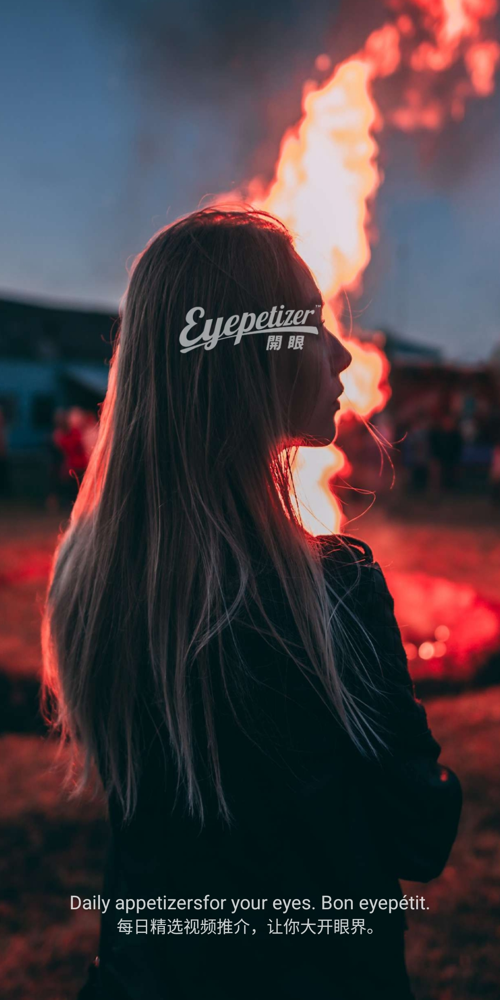

## 简介

这是一个仿开眼 Eyepetizer的 Android 客户端项目，java和kotlin混合的项目，没有复杂的设计。其中使用了Jetpack 组件，mvvm架构，写的过程中也参考过其余几个项目。一月份，电脑硬盘坏了一次，没有上传github的部分都丢失了，我又重新写了一部分缺失的代码（single分支），但还是很匆忙，但基本功能还是能用的，就这样吧。
## 主要功能
- 观看优质高清短视频与评论。
- 浏览社区图文与视频创作。
- 查看每日新鲜资讯与热搜关键词。
- 分享精彩短视频与新鲜资讯等。

## 屏幕截图

  

## 

**所有数据来源于开眼，仅供学习和交流使用，严禁用于任何商业用途，原作公司拥有所有权利。**

